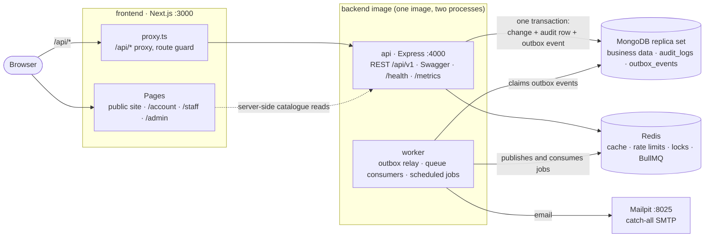

# Straight Salon

[](https://github.com/VaikashMB/straight-salon/actions/workflows/ci.yml)
[](https://sonarcloud.io/summary/overall?id=VaikashMB_straight-salon)
[](https://sonarcloud.io/summary/overall?id=VaikashMB_straight-salon)

Straight Salon is a booking and management app for a single-location hair and beauty salon. Customers browse services and stylists, book a time slot online, and reschedule, cancel or review their bookings. Stylists see their day and week and block personal time. The front desk handles walk-ins, phone bookings, check-ins and payments. The owner manages services, staff, working hours, holidays and settings, and sees the dashboard, revenue reports and the audit log.

**v1.0** is feature-complete against the specifications in [`docs/specs/`](docs/specs/). It was built by AI coding tools following those specs one phase at a time (see [How to use this pack with an AI coding tool](#how-to-use-this-pack-with-an-ai-coding-tool)), so the specs remain the reference for how the app behaves.

## Architecture



- **frontend** renders the public catalogue on the server and the signed-in areas in the browser. The browser talks only to the frontend origin. `proxy.ts` forwards `/api/*` to the API at request time, so the refresh cookie stays first-party.
- **api** is a modular monolith: routes, then controllers, services, repositories and Mongoose models, with Zod schemas generating both validation and the OpenAPI document. Every business change commits together with its audit row and its domain event (transactional outbox) in one MongoDB transaction.
- **worker** runs the outbox relay, which moves events into one BullMQ queue per consumer: notifications, staff notifications, cache invalidation, ratings and report stats. It also runs the scheduled jobs: reminders 24 h and 2 h ahead, auto no-show, stats reconcile and outbox cleanup. Delivery is at-least-once, so every consumer is idempotent.
- **Redis** is never the source of truth. If it goes down, reads fall back to MongoDB and readiness reports `degraded`. Bookings stay double-booking-proof through a per-stylist-day guard document inside the transaction.

Details: [01-architecture](docs/specs/01-architecture.md), [09-events-and-messaging](docs/specs/09-events-and-messaging.md), [11-docker-local-dev](docs/specs/11-docker-local-dev.md).

## Reference stack (v1)

| Layer                | Choice                                                                                                       |
| -------------------- | ------------------------------------------------------------------------------------------------------------ |
| Frontend             | Next.js 16 (App Router) + TypeScript + Tailwind CSS                                                          |
| Backend              | Node.js (24 LTS) + Express 5 + TypeScript (ESM)                                                              |
| Database             | MongoDB 7+ (Docker: `mongo:8.2`, see 11 §1; Mongoose ODM), single-node replica set for transactions          |
| Cache / Queue broker | Redis 7                                                                                                      |
| Messaging            | BullMQ on Redis (behind an `EventBus` abstraction so RabbitMQ/Kafka can be swapped in later)                 |
| Auth                 | JWT access token + rotating refresh token (httpOnly cookie)                                                  |
| API docs             | OpenAPI 3.1, generated from Zod schemas, served with Swagger UI                                              |
| Logging              | Pino (structured JSON) with request correlation IDs                                                          |
| Auditing             | Append-only `audit_logs` collection                                                                          |
| Testing              | Vitest + Supertest + mongodb-memory-server (backend), Vitest + React Testing Library + Playwright (frontend) |
| Quality gate         | SonarQube, minimum 80% coverage on new and overall code                                                      |
| Containers           | Docker + Docker Compose for local development                                                                |
| Automation           | ESLint, Prettier, Husky, lint-staged, commitlint, GitHub Actions CI, scheduled jobs                          |

The specs are written to be **stack-agnostic where possible**. Anything stack-specific is marked with a `[Node]`, `[Next]`, or `[Mongo]` tag so the same specs can be reused when you rebuild in another stack (e.g. Java/Spring, .NET, Go, Postgres).

## Spec index

| File                                    | Purpose                                                                            |
| --------------------------------------- | ---------------------------------------------------------------------------------- |
| `AGENTS.md`                             | Rules for the AI coding agent. Point your AI tool at this first.                   |
| `docs/specs/00-product-requirements.md` | What we're building and why: personas, features, user stories, acceptance criteria |
| `docs/specs/01-architecture.md`         | System design, repo layout, module boundaries, cross-cutting concerns              |
| `docs/specs/02-database.md`             | Collections, fields, indexes, constraints, seed data                               |
| `docs/specs/03-backend.md`              | Backend structure, layers, modules, business rules, config                         |
| `docs/specs/04-api-contract.md`         | Every endpoint: method, path, auth, request, response, errors; OpenAPI rules       |
| `docs/specs/05-frontend.md`             | Pages, routes, components, state, forms, UX rules                                  |
| `docs/specs/06-auth-and-security.md`    | JWT flow, roles and permissions, security controls                                 |
| `docs/specs/07-logging-and-auditing.md` | Log format, levels, correlation, audit trail                                       |
| `docs/specs/08-caching.md`              | What is cached, keys, TTLs, invalidation, rate limiting                            |
| `docs/specs/09-events-and-messaging.md` | Domain events, outbox pattern, workers, retries, idempotency                       |
| `docs/specs/10-testing-and-quality.md`  | Test strategy, coverage, SonarQube setup and quality gate                          |
| `docs/specs/11-docker-local-dev.md`     | Dockerfiles and docker-compose for local development                               |
| `docs/specs/12-automation-and-ci.md`    | Git hooks, scripts, CI pipeline, scheduled jobs                                    |
| `docs/specs/13-build-plan.md`           | Phased build order with ready-to-use prompts for the AI                            |

## Getting started (local development)

Status: **v1.0**. Every phase of [`13-build-plan.md`](docs/specs/13-build-plan.md) is complete. Work after v1 is the deployment track listed at the end of that file.

### Prerequisites

- Node.js **24** and npm ≥ 10. With [nvm](https://github.com/nvm-sh/nvm): `nvm install` (reads `.nvmrc`). Installs fail fast on other Node versions (`engine-strict`).
- Git.
- Docker Engine + Compose plugin (v2.24+), with your user in the `docker` group.

### Install and run

```bash
npm install                 # installs both workspaces and sets up the git hooks
npm run env:init            # creates .env (git-ignored) from .env.example with generated secrets
```

**Option A: everything in Docker** (hot reload via `docker-compose.override.yml`):

```bash
npm run up                  # docker compose up -d --build (applies migrations on start)
npm run seed                # demo data and accounts (see Demo accounts below)
docker compose ps           # all services healthy; mongo-init "exited (0)"
npm run logs                # follow backend + worker logs
npm run down                # stop (npm run reset also wipes the data volumes)
```

**Option B: infra in Docker, apps on the host:**

```bash
docker compose up -d mongo mongo-init redis mailpit
npm run dev                 # backend :4000, worker, frontend :3000
```

Try the API in Swagger UI: `POST /api/v1/auth/login` with a demo account and the header `X-Requested-With: straight-salon-web`, then **Authorize** with the returned `accessToken`.

### Local URLs

| What          | URL                                                                   | Notes                                                                                      |
| ------------- | --------------------------------------------------------------------- | ------------------------------------------------------------------------------------------ |
| App           | http://localhost:3000                                                 | Each role lands in its own area after sign-in (see below)                                  |
| API           | http://localhost:4000/api/v1                                          |                                                                                            |
| Swagger UI    | http://localhost:4000/api/docs                                        | Raw spec at `/api/docs/openapi.json`. On while `SWAGGER_ENABLED=true` (the `.env` default) |
| Health        | http://localhost:4000/health/live, http://localhost:4000/health/ready | Ready: `{"status":"ok","checks":{"mongo":{"status":"up"},"redis":{"status":"up"}}}`        |
| Metrics       | http://localhost:4000/metrics                                         | Prometheus format                                                                          |
| Bull Board    | http://localhost:4000/admin/queues                                    | The browser asks for an ADMIN email and password                                           |
| Mailpit       | http://localhost:8025                                                 | Every email the Docker stack sends, including password-reset links                         |
| Mongo Express | http://localhost:8081                                                 | `npm run tools`                                                                            |
| Redis Insight | http://localhost:5540                                                 | `npm run tools`                                                                            |
| SonarQube     | http://localhost:9000                                                 | `npm run sonar:up`, see below                                                              |

### Demo accounts

`npm run seed` creates these accounts. **All of them use the password `Password@123`.** They are for local development only: the seed refuses to run when `NODE_ENV=production`.

| Role         | Email                                                    | Lands on   | Can do                                                                                                           |
| ------------ | -------------------------------------------------------- | ---------- | ---------------------------------------------------------------------------------------------------------------- |
| Admin        | `admin@straightsalon.local`                              | `/admin`   | Everything: catalogue, staff, schedules, settings and holidays, team accounts, reports, audit log, notifications |
| Receptionist | `reception@straightsalon.local`                          | `/admin`   | Bookings, walk-ins, payments, customers, dashboard                                                               |
| Stylist      | `ravi@`, `priya@`, `arjun@`, `meera@straightsalon.local` | `/staff`   | Own day and week, booking status, time off (Arjun is off on Mondays)                                             |
| Customer     | `customer1@` … `customer10@straightsalon.local`          | `/account` | Book, reschedule, cancel, review, profile                                                                        |

The seed also adds the salon settings, 4 categories with about 15 services, schedules, a holiday next month, a few time-off blocks, about 60 bookings over the past 14 and next 7 days (paid where completed), a few reviews, and the ratings and report figures computed from them. Re-running it is safe.

### Useful commands

- Retry dead-lettered queue jobs: `npm run queues:retry-failed -- --queue=notifications`
- Rebuild the report read model (`daily_stats`) from bookings: `npm run stats:rebuild` (optionally `-- --from=YYYY-MM-DD --to=YYYY-MM-DD`)
- Production-style images only: `docker compose -f docker-compose.yml up -d --build`
- Mongo with authentication (enforces the append-only audit role): see `docker-compose.auth.yml`

### Checks

```bash
npm run lint            # ESLint, both workspaces
npm run typecheck       # tsc --noEmit, both workspaces
npm run test:coverage   # Vitest with 80% thresholds, both workspaces
npm run format:check    # Prettier
npm run validate        # everything CI will run (lint, format, typecheck, coverage, contract:check)
npm run openapi:export  # regenerate backend/openapi.json after API changes, then commit it
```

Backend integration tests start an in-memory MongoDB replica set automatically, and need a real Redis for the BullMQ tests: run `docker compose up -d redis` first (or set `REDIS_TEST_URL`).

### End-to-end tests (Playwright)

```bash
npm run up && npm run seed                    # or production images: docker compose -f docker-compose.yml up -d --build --wait backend frontend mailpit,
                                              #   then docker compose -f docker-compose.yml up -d worker && npm run db:seed
npx playwright install chromium -w frontend   # once (add --with-deps on a fresh machine)
npm run test:e2e                              # desktop Chromium + Pixel 7; report in frontend/playwright-report
```

The suite covers 05 §9: register → book → see in account → cancel, a stylist completing a booking, the receptionist recording a payment, and the admin seeing that revenue in the report. Its data is created per run with unique names, so the stack can be reused. Each run adds a few customers and bookings; `npm run reset` wipes them. The global setup clears the auth rate-limit counters in the compose Redis, so reruns within 15 minutes work (10 §4).

### SonarQube (local)

```bash
npm run sonar:up        # SonarQube on http://localhost:9000 (needs ~2 GB RAM, vm.max_map_count >= 262144)
npm run env:init        # generates SONAR_ADMIN_PASSWORD in .env if missing
npm run sonar:setup     # once: admin password, project, "Straight Salon Way" gate, SONAR_TOKEN into .env
npm run test:coverage && npm run sonar   # scan; fails when the quality gate is red
```

Sign in at http://localhost:9000 as `admin` with the `SONAR_ADMIN_PASSWORD` from `.env`.

### CI and releases

`.github/workflows/ci.yml` runs on pull requests and pushes to `main`:

- lint, format and typecheck
- `npm run audit` and gitleaks
- backend and frontend tests with coverage
- the OpenAPI contract check
- SonarCloud
- Docker image builds with a Trivy scan
- Playwright e2e (on `main`, and on PRs labelled `e2e`)

`npm run validate` runs the same checks locally, apart from the scans, image builds and e2e.

One-time GitHub setup:

- **SonarCloud:** import the repo, turn off automatic analysis, then add the secret `SONAR_TOKEN` and the variable `SONAR_ORGANIZATION`. Until then the `sonar` job skips with a notice.
- **`e2e` label:** create it, so PRs can opt in to the e2e job.
- **Branch protection on `main`:** require the CI checks and 1 review, with linear history and squash merge (12 §3).

Releases are cut by hand: Actions → **Release** → Run workflow on `main`. semantic-release then tags `vX.Y.Z` and publishes a GitHub Release with notes generated from the Conventional Commits. The first run creates v1.0.0.

Commits must follow Conventional Commits with a scope from `commitlint.config.mjs`, e.g. `feat(booking): add reschedule endpoint (API-054)`. The pre-commit hook lints and formats staged files; the pre-push hook runs unit tests for the workspaces you changed.

## How to use this pack with an AI coding tool

This app was built this way, and the same specs can drive a rebuild in another stack (stack-specific parts are tagged `[Node]`, `[Next]` or `[Mongo]`). To start from the specs:

1. Create an empty Git repository and copy `AGENTS.md`, `README.md` and `docs/specs/` into it.
2. Open the repo in your AI tool and tell it: _"Read AGENTS.md and all files in docs/specs. Then implement Phase 0 from 13-build-plan.md only."_
3. Review, run tests, commit. Then move to the next phase.
4. Never ask the AI to "build the whole app" in one go. Phase-by-phase is what keeps AI builds correct.

## Spec ID conventions

- `FR-xxx` functional requirement (00-product-requirements)
- `NFR-xxx` non-functional requirement
- `BR-xxx` business rule (03-backend)
- `EVT-xxx` domain event (09-events)
- `API-xxx` endpoint (04-api-contract)

Code comments, test names, and commit messages should reference these IDs, e.g. `test('BR-004 rejects overlapping bookings for same stylist', ...)`.

## Out of scope for v1 (planned for the deployment/FDE learning phase)

Kubernetes, Helm, cloud deployment, managed databases, horizontal scaling, observability stack (Prometheus/Grafana/Loki/OpenTelemetry collector), secrets managers, blue-green/canary releases. The v1 code is designed so these can be added without rewriting the application (12-factor config, health probes, stateless API, externalized state).

## Spec revision log

| Date       | Change                                                                                                                                                                                                                                                                                                                                                                                                                                                                                                                                                                                                                                                                                                                                                                                                                                                                               | Specs touched                                              |
| ---------- | ------------------------------------------------------------------------------------------------------------------------------------------------------------------------------------------------------------------------------------------------------------------------------------------------------------------------------------------------------------------------------------------------------------------------------------------------------------------------------------------------------------------------------------------------------------------------------------------------------------------------------------------------------------------------------------------------------------------------------------------------------------------------------------------------------------------------------------------------------------------------------------ | ---------------------------------------------------------- |
| 2026-10-06 | Phase 0 review: resolved ambiguities and contradictions. Key changes: staff-day guard document so BR-004 holds under concurrency without relying on Redis; `ss_session` indicator cookie for frontend route protection; runtime `/api/*` proxy in `proxy.ts` (Next 16) instead of build-time rewrites; root-context Docker builds for the workspace lockfile; `directConnection=true` for host-mode Mongo; lead-time filter applied after the availability cache; walk-in `checkInNow`; 422 `ACTIVE_BOOKINGS_EXIST` + `force` semantics for holidays/time-off; new error codes; extended permission map; image upload endpoint API-027; `booking.reminder_due` event (EVT-017); outbox `PUBLISHING`/`claimedAt`; incremental seed; Sonar test exclusions; explicit commit scopes.                                                                                                    | AGENTS, 00, 01, 02, 03, 04, 05, 06, 08, 09, 10, 11, 12, 13 |
| 2026-10-09 | Visual pass on the frontend (palette unchanged): `--accent-ink` for brass text (the brand brass is 2.9:1 as text), warm shadows, hero backdrop, motion that respects reduced motion; light/dark toggle (`lib/theme.ts`, pre-paint script); public header sticky with an active-link underline and a mobile menu below `md`, dark footer, category icons and tints, service and stylist images, "How it works"; booking wizard stepper, selected-card and time-chip styling, mobile summary bar, ticket-stub confirmation; signed-in dark sidebar with icon nav and profile block, KPI icons and report sparklines, status icons, now markers on timelines, illustrated empty states. The dev frontend container gets 2 GB (`next dev` was OOM-killed at 512 MB).                                                                                                                     | 05, 11, README                                             |
| 2026-10-09 | Phase 12, release v1.0: README rewritten for the finished app (overview, Mermaid architecture diagram, local URLs table, demo accounts); build plan marked complete. `v1.0.0` is created by the Release workflow (12 §1), not by hand.                                                                                                                                                                                                                                                                                                                                                                                                                                                                                                                                                                                                                                               | 13, README                                                 |
| 2026-10-09 | Phase 11 fix: the CI e2e job (and the README's production-image e2e command) failed because `docker compose up --wait` exits 1 on a service without a healthcheck, and the worker has none. It now waits for `backend frontend mailpit` (with their dependencies), then starts the worker.                                                                                                                                                                                                                                                                                                                                                                                                                                                                                                                                                                                           | 12, README                                                 |
| 2026-10-08 | Phase 11: Playwright e2e suite (one worker, Pixel 7 for the customer flow, rate-limit reset in global setup, browser clock for "My day"); CI pipeline with a cached-deps composite action, SonarCloud (skipped until `SONAR_TOKEN` is set), Trivy failing on fixable CRITICAL only, images passed from docker-build to e2e; manual semantic-release workflow (tag + GitHub Release, no commit back; first run = v1.0.0); `sonar:setup` script and the "Straight Salon Way" gate in MQR metrics; `npm run audit` with a reviewed, expiring allowlist (`braces` has no fix) and a `shell-quote` override; `.gitleaksignore` for test-only JWT secrets; lcov paths relative to the repo root; JUnit reporters in CI; all Blocker/High/Medium Sonar issues fixed. Fixed: `.gitignore`/`.dockerignore` `**/reports` patterns had kept the frontend reports page out of git and the image. | 01, 10, 11, 12, README                                     |
| 2026-10-07 | Phase 10: walk-in dialog also books a later time (FR-037, source `PHONE`); holidays live on the Settings page, team accounts on Customers; reception sees an "admins only" page for ADMIN pages; day views read up to 100 bookings; dashboard "next 2 hours" includes late arrivals; `--chart-1` chart hue (validated) and a data table per chart; `recharts` added; welcome pages and "soon" nav items removed.                                                                                                                                                                                                                                                                                                                                                                                                                                                                     | 05, README                                                 |
| 2026-10-07 | Phase 9: public catalogue pages render per request from API reads cached 5 min (`next.revalidate: 300`) instead of build-time ISR (no backend during `next build`); booking-wizard URL parameters and step fallbacks; one Idempotency-Key per distinct request body; disabled Cancel/Reschedule use `aria-disabled` so the cut-off tooltip is keyboard-reachable; STAFF `staffId` read from the access-token claim.                                                                                                                                                                                                                                                                                                                                                                                                                                                                  | 05, README                                                 |
| 2026-10-07 | Phase 8: `openapi-typescript` runs pinned via `npx` (its TypeScript 5 peer conflicts with the repo's TypeScript 6); `contract:check` also regenerates and diffs the frontend client; `NEXT_PUBLIC_DEFAULT_COUNTRY_CODE` (default 91) for phone normalisation, `NEXT_PUBLIC_API_BASE_PATH` retired; host-mode `next dev` reads only the frontend's variables from the root `.env`; area welcome pages and "soon" nav items until Phases 9/10; `msw` install script denied; `.dockerignore`/`.gitignore` no longer drop `backend/src/modules/reports`.                                                                                                                                                                                                                                                                                                                                 | 05, 12, README                                             |
| 2026-10-07 | Phase 7: `daily_stats` field definitions (revenue = paid completed bookings; per-service revenue split by price snapshot so it sums to the total; booked minutes exclude cancelled and no-show time; no-show rate excludes cancellations); `canReview` on the Booking DTO; ADMIN `includeHidden=true` on `GET /reviews`; second review 409 `DUPLICATE`; review window counted from completion; CSV layout and formula-injection guard; dashboard and summary response shapes; audit log `from`/`to` as salon-local dates; derived read models (ratings, `daily_stats`) not audited; seed recomputes ratings and stats; extra `reviews` indexes; `stats:rebuild` script.                                                                                                                                                                                                              | 02, 04, 07, 09, 12, README                                 |
| 2026-10-07 | Phase 6: `ratings`/`stats` consumers and `stats-reconcile` moved to Phase 7 (they need `reviews`/`daily_stats`); channel rules (account messages email-only and always sent; booking messages per `emailOptIn`/`smsOptIn`; deactivated users get nothing); reschedule clears the reminder flags; Bull Board uses HTTP Basic with an ADMIN's email and password; reset links are redacted in stored notifications; `queue_jobs` metric; `APP_BASE_URL` required; Docker stack sends email to Mailpit.                                                                                                                                                                                                                                                                                                                                                                                 | 02, 03, 04, 06, 09, 11, 12, 13, README                     |
| 2026-10-07 | Phase 5: STAFF see the customer's first name and a masked phone; one payment per booking (409 `PAYMENT_ALREADY_RECORDED`, 422 `PAYMENT_NOT_ALLOWED`); reception bookings default to source `PHONE`; manual `NO_SHOW` only after the start time; idempotency reserves the key while a request runs (409), stores only 2xx; payments module records through the bookings service; availability cache tags `avail` / `avail:{staffId}`; `/availability/days` returns `availableDates`; `/bookings/me` scope definitions; the no-op `ActiveBookingsGate` replaced by the bookings service.                                                                                                                                                                                                                                                                                               | 03, 04, 08, README                                         |
| 2026-10-06 | Phase 4: active-booking checks (API-018/020/032/036) go through an `ActiveBookingsGate` port, no-op until Phase 5; uploads served by the API at `/uploads` from a local ObjectStorage directory (`UPLOADS_DIR`, `UPLOADS_PUBLIC_URL`, `uploads_data` volume); ADMIN-only `includeInactive=true` on categories and staff; public settings include the booking policy; holidays and time-off are hard-deleted (audited); `INVALID_DURATION` code for BR-013; services get a partial unique index on active names; STAFF access tokens carry `staffId`; unpaginated lists are bare arrays.                                                                                                                                                                                                                                                                                              | 02, 03, 04, 08, 11, README                                 |
| 2026-10-06 | Phase 3: admins set a temporary password for new staff accounts; change-password keeps the current device signed in; own Redis rate limiter (fail-open global / fail-closed auth); CSRF header on every `POST /auth/*`; `INVALID_RESET_TOKEN`; wrong current password → 400 not 401; `walkin:create` permission; walk-in endpoint returns any existing customer by phone; admins can't change their own role/status; deactivation and role changes apply at next refresh; password max 72 bytes; `COOKIE_DOMAIN` empty by default; migrations as type-checked plain `.js` (changelog consistency); seed runs migrations and writes the admin.                                                                                                                                                                                                                                        | 02, 03, 04, 06, 07, 08, 10, 12, README                     |
| 2026-10-06 | Phase 2: access log as own middleware instead of `pino-http` (route pattern, exact 07 §1.3 fields); BullMQ job ID = `eventId` (BullMQ forbids `:`); outbox stores the full envelope, `secret` encrypted outside `payload`; static consumer routing table; `mongoose.trusted()` rule under `sanitizeFilter`; `PAYLOAD_TOO_LARGE` code; `env:init`; `contract:check` compares against the git index; `security/detect-object-injection` off; real Redis for BullMQ integration tests; `migrate-mongo` moved to Phase 3.                                                                                                                                                                                                                                                                                                                                                                | 02, 03, 04, 06, 07, 09, 10, 11, 12, 13, README             |
| 2026-10-06 | Phase 1: `/health/ready` treats Mongo as critical (503) and Redis as non-critical (200 `degraded`), reconciling 03 §6 with 08 §1; ioredis pinned to 5 for `ioredis-mock`; Docker builds from the repo root with `--ignore-scripts` and a separate prod-deps stage; numeric non-root UID; pinned image tags; `mongo:8.2` instead of 8.0 (8.0/8.3/9.0 refuse to start on Ubuntu 26.04 kernels until 8.0.35/9.0.3 images exist, 11 §1); separate worker image tag; host ports on 127.0.0.1; frontend gets no `.env`; Mongo auth overlay with verified append-only audit role; `shared/lifecycle` for entrypoints; worker skeleton.                                                                                                                                                                                                                                                      | 01, 03, 08, 10, 11, 12, 13, README                         |
| 2026-10-06 | Library updates: Node 24 LTS, Vitest for the backend (ESM), TypeScript 6.0 and ESLint 9 (newest majors supported by the lint toolchain), `jose`, `date-fns` v4 + `@date-fns/tz`, BullMQ Job Schedulers, `mongo:8.0`, `eslint-plugin-import-x`; dropped `hpp` (incompatible with Express 5) and `jest-sonar-reporter` (unmaintained).                                                                                                                                                                                                                                                                                                                                                                                                                                                                                                                                                 | 03, 05, 10, 11, 12, README                                 |
